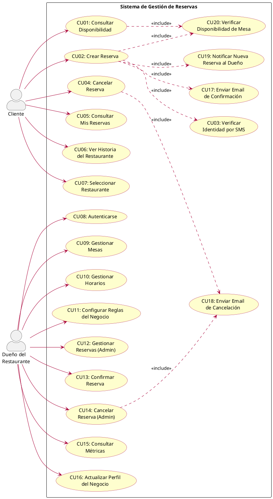
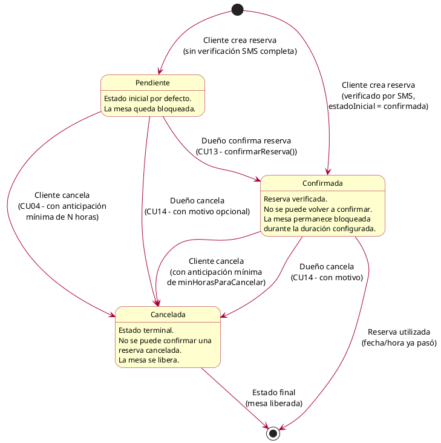
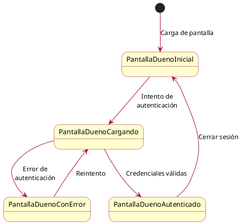
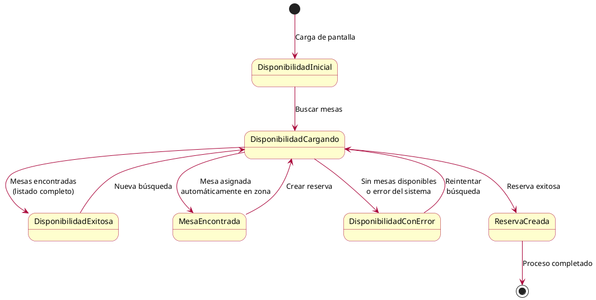

# Documentación UML - Sistema de Gestión de Reservas de Restaurante

---

## 1. Descripción del Sistema

### 1.1 Objetivo General

El **Sistema de Gestión de Reservas de Restaurante** es una aplicación web/móvil desarrollada en **Flutter** con arquitectura limpia (Clean Architecture), que permite a los clientes realizar reservas en un restaurante y a los dueños gestionar su negocio de forma integral.

### 1.2 Alcance del Sistema

| Módulo | Descripción |
|--------|-------------|
| **Gestión de Reservas** | Crear, confirmar, cancelar y consultar reservas con verificación de disponibilidad en tiempo real |
| **Gestión de Mesas** | Administrar mesas por zona (terraza, salón, jardín, barra/bar, VIP) con capacidad configurable |
| **Gestión de Negocio** | Registrar y configurar datos del restaurante (horarios, reglas de cancelación, duración de reservas) |
| **Verificación de Clientes** | Verificación por SMS vía Firebase Authentication antes de confirmar reservas |
| **Notificaciones por Email** | Envío automático de correos de confirmación, cancelación y notificación al dueño |
| **Autenticación del Dueño** | Login con email/contraseña o Google Sign-In para acceder al panel de administración |
| **Consulta de Disponibilidad** | Búsqueda de mesas disponibles por zona, fecha, hora y número de personas |

### 1.3 Arquitectura del Sistema

El sistema sigue un patrón de **Clean Architecture** con 4 capas:

```
┌──────────────────────────────────────────────┐
│            PRESENTACIÓN (UI)                 │
│  Screens, Cubits (BLoC), Widgets             │
├──────────────────────────────────────────────┤
│            APLICACIÓN (Casos de Uso)         │
│  CrearReserva, CancelarReserva,              │
│  ObtenerReserva                              │
├──────────────────────────────────────────────┤
│            DOMINIO (Entidades + Repositorios)│
│  Reserva, Mesa, Negocio, HorarioApertura,   │
│  HistoriaRestaurante                         │
├──────────────────────────────────────────────┤
│            ADAPTADORES (Infraestructura)     │
│  Firestore, Firebase Auth, Servicio Email,   │
│  Servicio Verificación SMS                   │
└──────────────────────────────────────────────┘
```

### 1.4 Tecnologías Utilizadas

- **Frontend**: Flutter (Dart)
- **Estado**: flutter_bloc (Cubits)
- **Backend/BD**: Firebase (Cloud Firestore)
- **Autenticación**: Firebase Auth + Google Sign-In
- **Inyección de Dependencias**: GetIt
- **Navegación**: GoRouter
- **Emails**: Firebase Trigger Email Extension (SMTP)

### 1.5 Actores del Sistema

| Actor | Descripción |
|-------|-------------|
| **Cliente** | Persona que desea reservar una mesa en el restaurante. No requiere cuenta; se verifica por SMS. |
| **Dueño del Restaurante** | Propietario o responsable del negocio. Accede al panel de administración con credenciales. |
| **Sistema (Firebase)** | Backend que gestiona autenticación, base de datos y envío de emails automáticos. |

---

## 2. Diagrama de Casos de Uso



### 2.1 Listado de Casos de Uso

| ID | Caso de Uso | Actor Principal | Descripción |
|----|-------------|----------------|-------------|
| CU01 | Consultar Disponibilidad | Cliente | Buscar mesas disponibles por zona, fecha, hora y número de personas |
| CU02 | Crear Reserva | Cliente | Reservar una mesa verificando disponibilidad e identidad por SMS |
| CU03 | Verificar Identidad por SMS | Cliente | Validar identidad del cliente mediante código SMS |
| CU04 | Cancelar Reserva | Cliente | Cancelar una reserva existente respetando reglas de anticipación |
| CU05 | Consultar Mis Reservas | Cliente | Ver el listado de reservas del cliente con estado actual |
| CU06 | Ver Historia del Restaurante | Cliente | Consultar información histórica y especialidades |
| CU07 | Seleccionar Restaurante | Cliente | Elegir un restaurante de la lista de negocios disponibles |
| CU08 | Autenticarse | Dueño | Iniciar sesión con email/contraseña o Google |
| CU09 | Gestionar Mesas | Dueño | Agregar, editar o eliminar mesas del restaurante |
| CU10 | Gestionar Horarios | Dueño | Definir horarios de apertura por día con múltiples intervalos |
| CU11 | Configurar Reglas del Negocio | Dueño | Ajustar duración de reservas, anticipación máxima y horas para cancelar |
| CU12 | Gestionar Reservas (Admin) | Dueño | Ver todas las reservas del negocio |
| CU13 | Confirmar Reserva | Dueño | Confirmar una reserva pendiente, enviando email al cliente |
| CU14 | Cancelar Reserva (Admin) | Dueño | Cancelar reserva con motivo opcional y notificación por email |
| CU15 | Consultar Métricas | Dueño | Ver estadísticas de reservas (total, confirmadas, canceladas, por mes) |
| CU16 | Actualizar Perfil del Negocio | Dueño | Modificar nombre, teléfono, especialidad, descripción e ícono |
| CU17 | Enviar Email de Confirmación | Sistema | Enviar correo automático con detalles de reserva confirmada |
| CU18 | Enviar Email de Cancelación | Sistema | Enviar correo automático informando cancelación |
| CU19 | Notificar Nueva Reserva al Dueño | Sistema | Enviar email al dueño cuando se crea una nueva reserva |
| CU20 | Verificar Disponibilidad de Mesa | Sistema | Validar que la mesa no tenga conflictos de horario |

---

## 3. Diagrama de Clases

```plantuml
@startuml Diagrama_de_Clases

skinparam classAttributeIconSize 0
skinparam class {
  BackgroundColor #FEFECE
  BorderColor #A80036
  ArrowColor #A80036
}

' ============================================================
' ENUMERACIONES
' ============================================================

enum EstadoReserva {
  pendiente
  confirmada
  cancelada
}

enum ZonaMesa {
  terraza
  salon
  jardin
  barraBar
  vip
  --
  - nombre : String
  - descripcion : String
}

' ============================================================
' ENTIDADES DEL DOMINIO
' ============================================================

class Reserva {
  - id : String
  - mesaId : String
  - fechaHora : DateTime
  - numeroPersonas : int
  - duracionMinutos : int
  - estado : EstadoReserva
  - contactoCliente : String?
  - nombreCliente : String?
  --
  + horaFin : DateTime  <<getter>>
  + confirmar() : void
  + copyWith() : Reserva
}

class Mesa {
  - id : String
  - nombre : String
  - capacidad : int
  - negocioId : String
  - zona : ZonaMesa
  --
  + puedeAcomodar(numeroPersonas : int) : bool
  + copyWith() : Mesa
}

class Negocio {
  - id : String
  - nombre : String
  - nombreResponsable : String
  - email : String
  - telefono : String
  - direccion : String
  - descripcion : String
  - especialidad : String
  - icono : String
  - minHorasParaCancelar : int
  - maxDiasAnticipacionReserva : int
  - duracionPromedioMinutos : int
  --
  + copyWith() : Negocio
}

class HorarioApertura {
  - negocioId : String
  - horariosSemanal : List<HorarioDia>
  --
  + estaAbiertoEn(fecha : DateTime) : bool
  + obtenerMensajeError(fecha : DateTime) : String
}

class HorarioDia {
  - nombreDia : String
  - cerrado : bool
  - intervalos : List<IntervaloHorario>
  --
  + estaAbierto(hora : int, minuto : int) : bool
}

class IntervaloHorario {
  - horaInicio : int
  - minutoInicio : int
  - horaFin : int
  - minutoFin : int
  --
  + contieneHora(hora : int, minuto : int) : bool
}

class HistoriaRestaurante {
  - titulo : String
  - subtitulo : String
  - parrafosHistoria : List<String>
  - especialidades : List<EspecialidadItem>
  --
  + copyWith() : HistoriaRestaurante
}

class EspecialidadItem {
  - nombre : String
  - descripcion : String
  - icono : IconData
}

' ============================================================
' REPOSITORIOS (INTERFACES)
' ============================================================

interface ReservaRepositorio <<interface>> {
  + crearReserva(reserva : Reserva) : Future<Reserva>
  + obtenerReserva() : Future<List<Reserva>>
  + cancelarReserva(reservaId : String) : Future<void>
  + obtenerReservaPorId(reservaId : String) : Future<Reserva?>
  + obtenerReservasPorMesaYHorario(mesaId, fecha, hora) : Future<List<Reserva>>
  + mesaDisponible(mesaId, fecha, hora, duracionMinutos) : Future<bool>
}

interface MesaRepositorio <<interface>> {
  + obtenerMesas() : Future<List<Mesa>>
  + obtenerMesaPorId(mesaId : String) : Future<Mesa?>
  + obtenerMesasPorNegocio(negocioId : String) : Future<List<Mesa>>
  + agregarMesa(mesa : Mesa) : Future<Mesa?>
  + actualizarMesa(mesa : Mesa) : Future<bool>
  + eliminarMesa(mesaId : String) : Future<bool>
  + obtenerZonasDisponibles(negocioId : String) : Future<List<ZonaMesa>>
  + buscarMesaDisponibleEnZona(zona, fecha, hora, personas, negocioId) : Future<Mesa?>
}

interface NegocioRepositorio <<interface>> {
  + registrarNegocio(nombre, responsable, email, tel, dir, pass) : Future<Negocio?>
  + autenticarNegocio(email, password) : Future<Negocio?>
  + obtenerTodosLosNegocios() : Future<List<Negocio>>
  + obtenerNegocioPorId(id : String) : Future<Negocio?>
  + obtenerNegocioPorEmail(email : String) : Future<Negocio?>
  + actualizarNegocio(negocio : Negocio) : Future<bool>
  + actualizarEmail(negocioId, nuevoEmail) : Future<bool>
}

interface HorarioAperturaRepositorio <<interface>> {
  + obtenerHorarioPorNegocio(negocioId : String) : Future<HorarioApertura?>
  + estaAbiertoEn(negocioId : String, fecha : DateTime) : Future<bool>
  + obtenerMensajeHorarioCerrado(negocioId, fecha) : Future<String>
  + obtenerIntervalosDisponibles(negocioId, fecha, intervalo) : Future<List<String>>
  + guardarHorario(horario : HorarioApertura) : Future<bool>
  + horarioAMapString(horario : HorarioApertura) : Map<String, String>
  + mapStringAHorario(negocioId, mapa) : HorarioApertura
}

' ============================================================
' CASOS DE USO (CAPA APLICACIÓN)
' ============================================================

class CrearReserva {
  - reservaRepositorio : ReservaRepositorio
  - mesaRepositorio : MesaRepositorio?
  - horarioAperturaRepositorio : HorarioAperturaRepositorio?
  - negocioRepositorio : NegocioRepositorio?
  --
  + ejecutar(mesaId, fecha, hora, numPersonas, negocioId, ...) : Future<Reserva>
}

class CancelarReserva {
  - reservaRepositorio : ReservaRepositorio
  - negocioRepositorio : NegocioRepositorio?
  --
  + ejecutar(reservaId : String, negocioId : String) : Future<void>
}

class ObtenerReserva {
  - reservaRepositorio : ReservaRepositorio
  --
  + ejecutar() : Future<List<Reserva>>
}

' ============================================================
' SERVICIOS (CAPA ADAPTADORES)
' ============================================================

class ServicioAutenticacion {
  + registrarConEmail(email, password) : Future
  + iniciarSesionConEmail(email, password) : Future
  + iniciarSesionConGoogle() : Future
  + cerrarSesion() : Future
  + enviarEmailVerificacion() : Future
  + enviarCodigoSMS(telefono, callbacks) : Future
  + verificarCodigoSMS(codigo : String) : Future
  + cambiarEmail(nuevoEmail, passwordActual) : Future
  + cambiarPassword(passwordActual, passwordNueva) : Future
}

class ServicioVerificacionCliente {
  + enviarCodigoSMS(telefono, callbacks) : Future
  + verificarCodigoSMS(codigo : String) : Future<String>
  + normalizarTelefono(telefono : String) : String
  + validarTelefono(telefono : String) : bool
  + guardarReserva(reserva : Map) : void
  + obtenerTodasReservas() : List
  + obtenerReservasPorTelefono(tel : String) : List
  + guardarSesionCliente(telefono, email) : void
  + obtenerSesionCliente() : Map?
  + limpiarSesionCliente() : void
}

class ServicioEmail {
  + enviarReservaConfirmada(email, nombre, negocio, fecha, mesa, personas) : Future
  + enviarReservaCanceladaPorCliente(email, nombre, negocio, fecha, mesa, personas) : Future
  + enviarReservaCanceladaPorRestaurante(email, nombre, negocio, fecha, mesa, personas, motivo?) : Future
  + enviarNuevaReservaAlDueno(emailDueno, cliente, fecha, mesa, personas, negocio) : Future
  + enviarCancelacionClienteAlDueno(emailDueno, cliente, fecha, mesa, personas, negocio) : Future
  + notificarReservaConfirmada(reserva : Reserva, nombreNegocio, mesa) : Future
  + notificarReservaCanceladaPorCliente(reserva, negocio, mesa) : Future
  + notificarReservaCanceladaPorRestaurante(reserva, negocio, mesa, motivo?) : Future
}

' ============================================================
' ADAPTADORES FIRESTORE (Implementaciones)
' ============================================================

class ReservaRepositorioFirestore {
}

class MesaRepositorioFirestore {
  - reservaRepositorio : ReservaRepositorio
}

class NegocioRepositorioFirestore {
}

class HorarioAperturaRepositorioFirestore {
}

' ============================================================
' RELACIONES
' ============================================================

' --- Entidad - Enum ---
Reserva --> EstadoReserva : tiene
Mesa --> ZonaMesa : tiene

' --- Asociaciones entre entidades ---
Reserva "0..*" --> "1" Mesa : referencia por mesaId
Mesa "0..*" --> "1" Negocio : pertenece a
HorarioApertura "1" --> "1" Negocio : configurado para
HorarioApertura "1" *-- "1..7" HorarioDia : contiene
HorarioDia "1" *-- "0..*" IntervaloHorario : contiene
HistoriaRestaurante "1" *-- "0..*" EspecialidadItem : contiene

' --- Repositorios gestionan entidades ---
ReservaRepositorio ..> Reserva : <<gestiona>>
MesaRepositorio ..> Mesa : <<gestiona>>
NegocioRepositorio ..> Negocio : <<gestiona>>
HorarioAperturaRepositorio ..> HorarioApertura : <<gestiona>>

' --- Implementaciones de repositorios ---
ReservaRepositorioFirestore ..|> ReservaRepositorio : <<implements>>
MesaRepositorioFirestore ..|> MesaRepositorio : <<implements>>
NegocioRepositorioFirestore ..|> NegocioRepositorio : <<implements>>
HorarioAperturaRepositorioFirestore ..|> HorarioAperturaRepositorio : <<implements>>

' --- Casos de uso usan repositorios ---
CrearReserva --> ReservaRepositorio : usa
CrearReserva --> MesaRepositorio : usa
CrearReserva --> HorarioAperturaRepositorio : usa
CrearReserva --> NegocioRepositorio : usa
CancelarReserva --> ReservaRepositorio : usa
CancelarReserva --> NegocioRepositorio : usa
ObtenerReserva --> ReservaRepositorio : usa

' --- Dependencia de adaptadores ---
MesaRepositorioFirestore --> ReservaRepositorio : verifica disponibilidad

@enduml
```



---

## 4. Diagrama de Transición de Estados

### 4.1 Estados de la Reserva

La entidad `Reserva` tiene un ciclo de vida claro con 3 estados posibles:



### 4.2 Reglas de Transición

| Transición | Condiciones | Validaciones |
|-----------|-------------|--------------|
| `[*] → Pendiente` | Cliente crea reserva sin verificación SMS completa | Fecha futura, mesa con capacidad adecuada, restaurante abierto, mesa sin conflictos |
| `[*] → Confirmada` | Cliente crea reserva verificado por SMS (flujo principal) | Mismas validaciones + verificación SMS exitosa |
| `Pendiente → Confirmada` | Dueño confirma manualmente desde el panel admin | `estado != cancelada` y `estado != confirmada` |
| `Pendiente → Cancelada` | Cliente o dueño cancela la reserva | Cliente: `diferenciaHoras >= minHorasParaCancelar` y `fechaHora > ahora` |
| `Confirmada → Cancelada` | Cliente o dueño cancela la reserva | Mismas validaciones que Pendiente → Cancelada |
| `Cancelada → ∅` | No se permite ninguna transición desde Cancelada | `throw Exception('No se puede confirmar una reserva cancelada')` |

### 4.3 Estados del Panel del Dueño



### 4.4 Estados de Disponibilidad (Flujo de Reserva del Cliente)



---

## 5. Especificaciones de Casos de Uso

---

### 5.1 CU02: Crear Reserva — Especificación Completa

> **Este es el caso de uso más relevante para el negocio**, ya que representa la función central del sistema: permitir que un cliente reserve una mesa en el restaurante.

| Campo | Descripción |
|-------|-------------|
| **ID** | CU02 |
| **Nombre** | Crear Reserva |
| **Actor Principal** | Cliente |
| **Actores Secundarios** | Sistema (Firebase Auth, Firestore, Email) |
| **Descripción** | El cliente busca una mesa disponible por zona, fecha, hora y número de personas, luego proporciona sus datos y verifica su identidad por SMS para confirmar la reserva |
| **Prioridad** | ⭐ Alta (función central del sistema) |

#### 5.1.1 Parámetros de Entrada

| Parámetro | Tipo | Obligatorio | Descripción | Validaciones |
|-----------|------|:-----------:|-------------|-------------|
| `zona` | `ZonaMesa` (enum) | ✅ | Zona del restaurante (terraza, salón, jardín, barra/bar, VIP) | Debe ser una zona con mesas disponibles |
| `fecha` | `DateTime` | ✅ | Fecha de la reserva | Debe ser futura, máximo `maxDiasAnticipacionReserva` días adelante (default: 14) |
| `hora` | `DateTime` (hora) | ✅ | Hora de inicio de la reserva | Debe estar dentro del horario de apertura del restaurante |
| `numeroPersonas` | `int` | ✅ | Cantidad de comensales | Mayor a 0. La mesa debe tener `capacidad >= personas` y `capacidad <= personas + 3` |
| `nombreCliente` | `String` | ✅ | Nombre del cliente | No vacío |
| `emailCliente` | `String` | ✅ | Email del cliente (para notificaciones) | Formato email válido |
| `telefono` | `String` | ✅ | Teléfono del cliente (para verificación SMS) | Formato argentino válido (ej: 11 1234-5678) |
| `negocioId` | `String` | ✅ (automático) | ID del negocio seleccionado | Se obtiene automáticamente del restaurante |

#### 5.1.2 Parámetros de Salida

| Parámetro | Tipo | Descripción |
|-----------|------|-------------|
| `reserva` | `Reserva` | Objeto reserva creado con ID generado por Firestore |
| `mensaje` | `String` | Mensaje de confirmación: "✅ Reserva confirmada exitosamente..." |
| Email de confirmación | Email HTML | Enviado al `emailCliente` con detalles de la reserva |
| Email de notificación | Email HTML | Enviado al dueño informando la nueva reserva |

#### 5.1.3 Precondiciones (Estado Inicial)

1. El sistema debe tener al menos un negocio registrado en Firestore
2. El negocio debe tener mesas configuradas con zonas asignadas
3. El negocio debe tener horarios de apertura definidos
4. El servicio de Firebase Auth debe estar operativo (para SMS)
5. La extensión Firebase Trigger Email debe estar configurada (para emails)
6. El cliente debe tener acceso a un teléfono para recibir el código SMS

#### 5.1.4 Postcondiciones (Estado Final - Escenario Exitoso)

1. Se crea un documento `Reserva` en Firestore con `estado = confirmada`
2. La mesa queda bloqueada para el intervalo `[fechaHora, fechaHora + duracionMinutos)`
3. El cliente recibe un email de confirmación con los detalles de la reserva
4. El dueño recibe un email de notificación sobre la nueva reserva
5. La reserva se guarda en el `localStorage` del cliente para consultarla en "Mis Reservas"
6. La interfaz navega de vuelta mostrando el mensaje de éxito

#### 5.1.5 Flujo Principal (Camino Feliz)

| Paso | Actor | Acción |
|:----:|-------|--------|
| 1 | Cliente | Accede a la pantalla "Disponibilidad" desde el menú principal |
| 2 | Sistema | Carga las mesas, horarios y configuración del negocio desde Firestore |
| 3 | Sistema | Muestra los horarios de atención del restaurante |
| 4 | Cliente | Selecciona la **zona** deseada (ej: Terraza) |
| 5 | Cliente | Selecciona la **fecha** usando el DatePicker (máximo 14 días adelante) |
| 6 | Sistema | Calcula y muestra los intervalos de horarios disponibles según la fecha |
| 7 | Cliente | Selecciona el **horario** del dropdown de intervalos disponibles |
| 8 | Cliente | Selecciona el **número de personas** con los botones +/- |
| 9 | Cliente | Presiona el botón **"Buscar Mesa Disponible"** |
| 10 | Sistema | Ejecuta `buscarMesaDisponibleEnZona()`: filtra por zona, capacidad y disponibilidad |
| 11 | Sistema | Muestra la tarjeta con la mesa encontrada (nombre, zona, capacidad, horario) |
| 12 | Cliente | Presiona **"Reservar Esta Mesa"** |
| 13 | Sistema | Muestra diálogo de confirmación solicitando nombre, email y teléfono |
| 14 | Cliente | Completa los campos y presiona **"Continuar y Verificar"** |
| 15 | Sistema | Normaliza y valida el número de teléfono (formato argentino E.164) |
| 16 | Sistema | Envía código SMS de verificación vía Firebase Auth (`enviarCodigoSMS()`) |
| 17 | Sistema | Muestra diálogo de verificación SMS con campo para código y timer de 120s |
| 18 | Cliente | Ingresa el código de 6 dígitos recibido por SMS |
| 19 | Sistema | Verifica el código vía `verificarCodigoSMS()` |
| 20 | Sistema | Ejecuta `CrearReserva.ejecutar()` con `estadoInicial = confirmada` |
| 21 | Sistema | Valida: fecha futura, capacidad de mesa, horario de apertura, disponibilidad |
| 22 | Sistema | Crea el documento `Reserva` en Firestore |
| 23 | Sistema | Envía email de confirmación al cliente vía `notificarReservaConfirmada()` |
| 24 | Sistema | Guarda la reserva en localStorage del cliente |
| 25 | Sistema | Muestra SnackBar de éxito y regresa a la pantalla principal |

#### 5.1.6 Flujos Alternativos

**FA1: No hay mesas disponibles en la zona seleccionada**

| Paso | Actor | Acción |
|:----:|-------|--------|
| 10a | Sistema | `buscarMesaDisponibleEnZona()` no encuentra ninguna mesa |
| 10b | Sistema | Muestra mensaje: *"No hay mesas disponibles en [zona] para X personas en ese horario"* |
| 10c | Cliente | Puede cambiar zona, horario o número de personas e intentar de nuevo |

**FA2: El restaurante está cerrado en el horario seleccionado**

| Paso | Actor | Acción |
|:----:|-------|--------|
| 21a | Sistema | `estaAbiertoEn()` retorna `false` |
| 21b | Sistema | Muestra mensaje con horarios de atención del día seleccionado |
| 21c | Cliente | Debe seleccionar un horario dentro del horario de atención |

**FA3: La mesa ya está reservada (conflicto de horario)**

| Paso | Actor | Acción |
|:----:|-------|--------|
| 21d | Sistema | `mesaDisponible()` retorna `false` (superposición de intervalos) |
| 21e | Sistema | Muestra: *"La mesa seleccionada ya está reservada en ese horario"* |

**FA4: Error en verificación SMS**

| Paso | Actor | Acción |
|:----:|-------|--------|
| 19a | Sistema | Código SMS inválido o expirado |
| 19b | Sistema | Muestra mensaje de error en el diálogo |
| 19c | Cliente | Puede solicitar reenvío de código o cerrar y reintentar |

**FA5: Fecha excede anticipación máxima**

| Paso | Actor | Acción |
|:----:|-------|--------|
| 21f | Sistema | `fechaHora > now + maxDiasAnticipacionReserva` |
| 21g | Sistema | Muestra: *"Solo se pueden hacer reservas hasta dentro de X días como máximo"* |

**FA6: Mesa demasiado grande o pequeña para el grupo**

| Paso | Actor | Acción |
|:----:|-------|--------|
| 21h | Sistema | `mesa.puedeAcomodar(numeroPersonas)` retorna `false` |
| 21i | Sistema | Si `capacidad < personas`: *"Mesa muy pequeña"* |
| 21j | Sistema | Si `capacidad > personas + 3`: *"Mesa muy grande, selecciona una más adecuada"* |

#### 5.1.7 Excepciones

| Código | Excepción | Causa |
|--------|----------|-------|
| E1 | `'La fecha y hora deben ser futuras.'` | `fechaHora.isBefore(now)` |
| E2 | `'Solo se pueden hacer reservas hasta dentro de X días.'` | Supera `maxDiasAnticipacionReserva` |
| E3 | `'El número de personas debe ser mayor a cero.'` | `numeroPersonas <= 0` |
| E4 | `'La mesa seleccionada no existe.'` | `obtenerMesaPorId()` retorna null |
| E5 | `'La mesa tiene capacidad para X personas...'` | Mesa no acomoda al grupo |
| E6 | Mensaje de horario cerrado (dinámico) | Restaurante cerrado |
| E7 | `'La mesa ya está reservada en ese horario.'` | Conflicto de disponibilidad |

---

### 5.2 CU04: Cancelar Reserva (Especificación Resumida)

| Campo | Descripción |
|-------|-------------|
| **ID** | CU04 |
| **Actor Principal** | Cliente |
| **Precondiciones** | Existe una reserva con estado `pendiente` o `confirmada`; la fecha de la reserva es futura |
| **Postcondiciones** | La reserva pasa a estado `cancelada`; la mesa se libera; se envía email de cancelación |

**Parámetros:**

| Parámetro | Tipo | Descripción |
|-----------|------|-------------|
| `reservaId` | `String` | ID de la reserva a cancelar |
| `negocioId` | `String` | ID del negocio (para obtener `minHorasParaCancelar`) |

**Validaciones clave:**
- `estado == confirmada || estado == pendiente`
- `fechaHora > ahora` (no pasada)
- `diferencia.inHours >= minHorasParaCancelar` (default: 24 horas)

---

### 5.3 CU08: Autenticarse (Dueño) (Especificación Resumida)

| Campo | Descripción |
|-------|-------------|
| **ID** | CU08 |
| **Actor Principal** | Dueño del Restaurante |
| **Precondiciones** | El negocio está registrado en Firestore con email y contraseña |
| **Postcondiciones** | El dueño accede al panel de administración con su negocio cargado |

**Parámetros:**

| Parámetro | Tipo | Descripción |
|-----------|------|-------------|
| `email` | `String` | Email del negocio registrado |
| `password` | `String` | Contraseña del negocio |

**Flujo:** Dueño ingresa credenciales → `autenticarNegocio()` → Si válido: `PantallaDuenoAutenticado` → Si falla: `PantallaDuenoConError`

---

### 5.4 CU09: Gestionar Mesas (Especificación Resumida)

| Campo | Descripción |
|-------|-------------|
| **ID** | CU09 |
| **Actor Principal** | Dueño del Restaurante |
| **Precondiciones** | Dueño autenticado en el panel de administración |
| **Postcondiciones** | Las mesas del negocio se actualizan en Firestore |

**Operaciones disponibles:**

| Operación | Parámetros | Descripción |
|-----------|-----------|-------------|
| Agregar mesa | `negocioId`, `nombre`, `capacidad` | Crea nueva mesa en el negocio |
| Actualizar mesa | `Mesa` (objeto completo) | Modifica nombre, capacidad o zona |
| Eliminar mesa | `mesaId` | Elimina la mesa del sistema |

---

## 6. Trazabilidad Arquitectura ↔ Casos de Uso

| Caso de Uso | Capa Presentación | Capa Aplicación | Capa Dominio | Capa Adaptadores |
|------------|-------------------|----------------|-------------|-----------------|
| CU02 - Crear Reserva | `DisponibilidadScreen` + `DisponibilidadCubit` | `CrearReserva` | `Reserva`, `Mesa`, `Negocio`, `HorarioApertura` | `ReservaRepositorioFirestore`, `MesaRepositorioFirestore`, `ServicioVerificacionCliente`, `ServicioEmail` |
| CU04 - Cancelar Reserva | `MisReservasScreen` + `MisReservasCubit` | `CancelarReserva` | `Reserva` | `ReservaRepositorioFirestore` |
| CU05 - Mis Reservas | `MisReservasScreen` + `MisReservasCubit` | `ObtenerReserva` | `Reserva` | `ReservaRepositorioFirestore` |
| CU08 - Autenticarse | `PantallaDuenoScreen` + `PantallaDuenoCubit` | — | `Negocio` | `NegocioRepositorioFirestore` |
| CU09 - Gestionar Mesas | `PantallaDuenoScreen` + `PantallaDuenoCubit` | — | `Mesa` | `MesaRepositorioFirestore` |
| CU10 - Gestionar Horarios | `PantallaDuenoScreen` + `PantallaDuenoCubit` | — | `HorarioApertura` | `HorarioAperturaRepositorioFirestore` |
