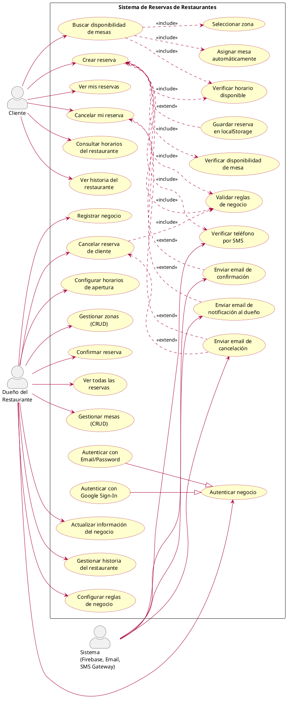
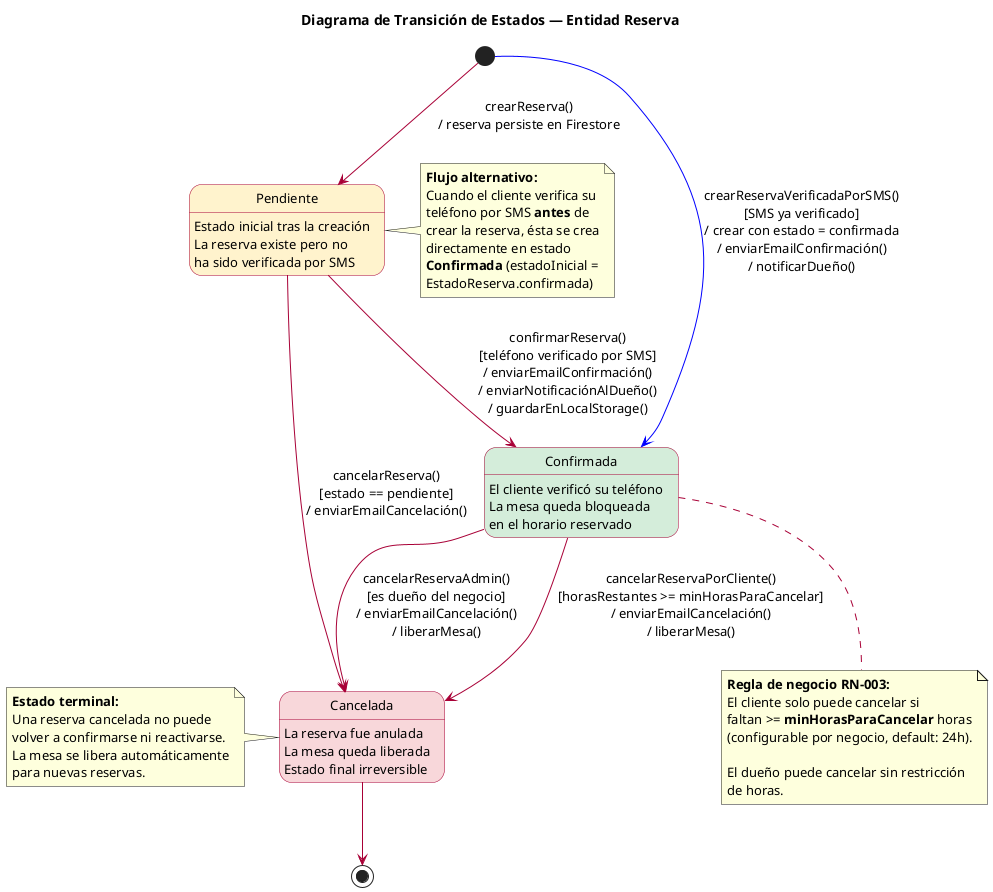

# DOCUMENTACIÓN TÉCNICA UML — SISTEMA DE RESERVAS DE RESTAURANTES

**Proyecto:** App Restaurante — Sistema de Reservas  
**Versión:** 1.0  
**Fecha:** Febrero 2026  
**Repositorio:** AgustinLuconi/Software_Restaurante  
**Stack:** Flutter 3.29.2 · Dart 3.7.2 · Firebase · BLoC/Cubit

---

## 1. DESCRIPCIÓN DEL SISTEMA

El **Sistema de Reservas de Restaurantes** es una aplicación web desarrollada en Flutter que resuelve la problemática de la gestión manual e ineficiente de reservas en establecimientos gastronómicos. Su propósito principal es digitalizar el proceso completo de reserva de mesas, conectando a los clientes que desean reservar con los dueños de restaurantes que administran su negocio.

El sistema está dirigido a dos tipos de usuarios: **clientes** que buscan disponibilidad y reservan mesas de forma autónoma, y **dueños de restaurantes** que configuran y administran su establecimiento de manera integral.

Las **funcionalidades clave** del sistema son:

1. **Reserva inteligente de mesas**: Búsqueda automática de mesas disponibles por zona, fecha, horario y cantidad de personas, con algoritmo de asignación que optimiza la ocupación evitando desperdiciar mesas grandes para grupos pequeños.
2. **Verificación de identidad por SMS**: Integración con Firebase Phone Auth para verificar el teléfono del cliente antes de confirmar la reserva.
3. **Gestión completa del negocio**: Panel de administración para dueños con CRUD de mesas, zonas, horarios de apertura y configuración de reglas de negocio (anticipación máxima, duración de reservas, horas mínimas para cancelación).
4. **Notificaciones automáticas por email**: Envío de correos de confirmación y cancelación tanto al cliente como al dueño mediante Firebase Trigger Email Extension.
5. **Visualización de disponibilidad en tiempo real**: Consulta de horarios disponibles y mesas libres basada en los horarios de apertura configurados y las reservas existentes.
6. **Gestión de reservas**: Visualización, confirmación y cancelación de reservas con validaciones de reglas de negocio configurables.
7. **Autenticación dual**: Los dueños acceden mediante email/contraseña o Google Sign-In a través de Firebase Authentication.

El proyecto implementa **Clean Architecture** organizada en cuatro capas: Dominio (entidades y repositorios abstractos), Aplicación (casos de uso), Adaptadores (implementaciones Firestore y servicios Firebase) y Presentación (pantallas con patrón BLoC/Cubit). La inyección de dependencias se gestiona con GetIt, y la navegación con GoRouter. Los datos persisten en Cloud Firestore, organizados en colecciones de negocios, mesas, zonas, reservas y horarios de apertura.

---

## 2. DIAGRAMA DE CASOS DE USO (UML)



### Descripción de Casos de Uso Principales

| ID | Caso de Uso | Actor Primario | Descripción |
|----|-------------|----------------|-------------|
| UC-01 | Buscar disponibilidad de mesas | Cliente | El cliente selecciona zona, fecha, hora y cantidad de personas. El sistema busca automáticamente una mesa adecuada disponible. |
| UC-03 | Crear reserva | Cliente | Flujo completo de reserva: selección de parámetros, verificación SMS, creación en Firestore y envío de notificaciones. |
| UC-04 | Verificar teléfono por SMS | Sistema | Firebase Phone Auth envía código SMS al cliente, quien debe ingresarlo para confirmar su identidad. |
| UC-05 | Ver mis reservas | Cliente | El cliente consulta sus reservas asociadas por teléfono verificado, almacenadas en localStorage. |
| UC-06 | Cancelar mi reserva | Cliente | El cliente cancela una reserva respetando la regla de horas mínimas de anticipación configurada por el negocio. |
| UC-09 | Registrar negocio | Dueño | Registro con datos del restaurante, responsable, email y contraseña. Se crean 3 zonas iniciales por defecto. |
| UC-10 | Autenticar negocio | Dueño | Acceso al panel administrativo mediante Email/Password o Google Sign-In (Firebase Auth). |
| UC-11 | Gestionar mesas (CRUD) | Dueño | Alta, baja, modificación y listado de mesas. Cada mesa tiene nombre, capacidad y zona asignada. |
| UC-13 | Configurar horarios de apertura | Dueño | Definir intervalos horarios por día de la semana (soporta turnos split, ej: almuerzo y cena). |
| UC-14 | Ver todas las reservas | Dueño | Visualizar todas las reservas del negocio filtradas por las mesas que le pertenecen. |
| UC-16 | Cancelar reserva de cliente | Dueño | El dueño cancela una reserva existente, validando reglas de negocio y notificando al cliente. |
| UC-19 | Configurar reglas de negocio | Dueño | Ajustar duración promedio de reservas, máximo días de anticipación y horas mínimas para cancelar. |

---

## 3. DIAGRAMA DE CLASES (UML)

```plantuml
@startuml DiagramaDeClases
skinparam classAttributeIconSize 0
skinparam class {
  BackgroundColor #FEFECE
  BorderColor #A80036
  ArrowColor #A80036
}
skinparam package {
  BackgroundColor #F8F8F8
  BorderColor #888888
}
skinparam stereotypeCBackgroundColor #ADD8E6

' ===============================================================
' CAPA DE DOMINIO — ENTIDADES
' ===============================================================
package "Dominio" #EEEEFF {

  package "Entidades" {

    enum EstadoReserva {
      pendiente
      confirmada
      cancelada
    }

    class Reserva {
      - id : String
      - mesaId : String
      - fechaHora : DateTime
      - numeroPersonas : int
      - duracionMinutos : int = 60
      - estado : EstadoReserva
      - contactoCliente : String?
      - nombreCliente : String?
      __
      + horaFin : DateTime  <<getter>>
      + estaActiva : bool  <<getter>>
      + copyWith(...) : Reserva
    }

    class Mesa {
      - id : String
      - nombre : String
      - capacidad : int
      - negocioId : String
      - zonaId : String
      __
      + puedeAcomodar(numeroPersonas : int) : bool
      + copyWith(...) : Mesa
    }

    class Negocio {
      - id : String
      - nombre : String
      - nombreResponsable : String
      - email : String
      - telefono : String
      - direccion : String
      - descripcion : String
      - especialidad : String
      - icono : String
      - minHorasParaCancelar : int = 24
      - maxDiasAnticipacionReserva : int = 14
      - duracionPromedioMinutos : int = 60
      __
      + copyWith(...) : Negocio
    }

    class Zona {
      - id : String
      - nombre : String
      - descripcion : String
      - negocioId : String
      - colorHex : String?
      __
      + copyWith(...) : Zona
      {static} + zonasIniciales(negocioId : String) : List<Zona>
    }

    class HorarioApertura {
      - negocioId : String
      - horariosSemanal : List<HorarioDia>
      __
      + estaAbiertoEn(fecha : DateTime) : bool
      + obtenerMensajeError(fecha : DateTime) : String
      - _obtenerNumeroDia(nombreDia : String) : int
    }

    class HorarioDia {
      - nombreDia : String
      - cerrado : bool
      - intervalos : List<IntervaloHorario>
      __
      + estaAbierto(hora : int, minuto : int) : bool
    }

    class IntervaloHorario {
      - horaInicio : int
      - minutoInicio : int
      - horaFin : int
      - minutoFin : int
      __
      + contieneHora(hora : int, minuto : int) : bool
    }

    class HistoriaRestaurante {
      - titulo : String
      - subtitulo : String
      - parrafosHistoria : List<String>
      - especialidades : List<EspecialidadItem>
      __
      + copyWith(...) : HistoriaRestaurante
    }

    class EspecialidadItem {
      - nombre : String
      - descripcion : String
      - icono : IconData
    }

    class HistoriaData {
      {static} + actual : HistoriaRestaurante
    }

  }

  ' === RELACIONES ENTRE ENTIDADES ===
  Reserva *-- EstadoReserva
  Reserva "0..*" --> "1" Mesa : mesaId
  Mesa "0..*" --> "1" Negocio : negocioId
  Mesa "0..*" --> "1" Zona : zonaId
  Zona "0..*" --> "1" Negocio : negocioId
  HorarioApertura "1" --> "1" Negocio : negocioId
  HorarioApertura *-- "7" HorarioDia
  HorarioDia *-- "0..*" IntervaloHorario
  HistoriaRestaurante *-- "0..*" EspecialidadItem
  HistoriaData --> HistoriaRestaurante

  ' ===============================================================
  ' CAPA DE DOMINIO — REPOSITORIOS (INTERFACES)
  ' ===============================================================
  package "Repositorios" {

    interface ReservaRepositorio <<abstract>> {
      + crearReserva(reserva : Reserva) : Future<Reserva>
      + obtenerReserva() : Future<List<Reserva>>
      + cancelarReserva(reservaId : String) : Future<void>
      + confirmarReserva(reservaId : String) : Future<void>
      + obtenerReservaPorId(reservaId : String) : Future<Reserva?>
      + obtenerReservasPorMesaIds(mesaIds : List<String>) : Future<List<Reserva>>
      + obtenerReservasPorContacto(contacto : String) : Future<List<Reserva>>
      + obtenerReservasPorMesaYHorario(...) : Future<List<Reserva>>
      + mesaDisponible(...) : Future<bool>
    }

    interface MesaRepositorio <<abstract>> {
      + obtenerMesas() : Future<List<Mesa>>
      + obtenerMesaPorId(mesaId : String) : Future<Mesa?>
      + obtenerMesasPorNegocio(negocioId : String) : Future<List<Mesa>>
      + agregarMesa(mesa : Mesa) : Future<Mesa?>
      + actualizarMesa(mesa : Mesa) : Future<bool>
      + eliminarMesa(mesaId : String) : Future<bool>
      + obtenerZonasDisponibles(negocioId : String) : Future<List<String>>
      + buscarMesaDisponibleEnZona(...) : Future<Mesa?>
    }

    interface NegocioRepositorio <<abstract>> {
      + registrarNegocio(...) : Future<Negocio?>
      + autenticarNegocio(email, password) : Future<Negocio?>
      + obtenerTodosLosNegocios() : Future<List<Negocio>>
      + obtenerNegocioPorId(id : String) : Future<Negocio?>
      + obtenerNegocioPorEmail(email : String) : Future<Negocio?>
      + actualizarNegocio(negocio : Negocio) : Future<bool>
      + actualizarEmail(negocioId, nuevoEmail) : Future<bool>
      + actualizarPassword(negocioId, nuevaPassword) : Future<bool>
    }

    interface HorarioAperturaRepositorio <<abstract>> {
      + obtenerHorarioPorNegocio(negocioId : String) : Future<HorarioApertura?>
      + estaAbiertoEn(negocioId, fecha) : Future<bool>
      + obtenerMensajeHorarioCerrado(negocioId, fecha) : Future<String>
      + obtenerIntervalosDisponibles(negocioId, fecha) : Future<List<String>>
      + guardarHorario(horario : HorarioApertura) : Future<bool>
      + horarioAMapString(horario) : Map<String, String>
      + mapStringAHorario(negocioId, mapa) : HorarioApertura
    }

    interface ZonaRepositorio <<abstract>> {
      + obtenerZonasPorNegocio(negocioId : String) : Future<List<Zona>>
      + crearZona(zona : Zona) : Future<Zona?>
      + actualizarZona(zona : Zona) : Future<bool>
      + eliminarZona(zonaId : String) : Future<bool>
      + tieneMesasAsignadas(zonaId : String) : Future<bool>
    }

  }

  ' ===============================================================
  ' CAPA DE DOMINIO — UTILIDADES
  ' ===============================================================
  package "Utilidades" {
    class TelefonoUtils <<static>> {
      - TelefonoUtils._()
      {static} + normalizar(telefono : String) : String
      {static} + validar(telefono : String) : Map<String, dynamic>
      {static} + formatoNacional(e164 : String) : String
    }
  }

}

' ===============================================================
' CAPA DE APLICACIÓN — CASOS DE USO
' ===============================================================
package "Aplicación" #EEFFEE {

  class CrearReserva {
    - reservaRepositorio : ReservaRepositorio
    - mesaRepositorio : MesaRepositorio
    - horarioAperturaRepositorio : HorarioAperturaRepositorio
    - negocioRepositorio : NegocioRepositorio
    __
    + ejecutar(mesaId, fecha, hora,\n  numeroPersonas, {contactoCliente,\n  nombreCliente, estadoInicial,\n  negocioId}) : Future<Reserva>
  }

  class CancelarReserva {
    - reservaRepositorio : ReservaRepositorio
    - negocioRepositorio : NegocioRepositorio
    __
    + ejecutar(reservaId,\n  {negocioId}) : Future<void>
  }

  class ObtenerReserva {
    - reservaRepositorio : ReservaRepositorio
    __
    + ejecutar({contactoCliente}) : Future<List<Reserva>>
  }

  ' === DEPENDENCIAS DE CASOS DE USO ===
  CrearReserva ..> ReservaRepositorio : <<usa>>
  CrearReserva ..> MesaRepositorio : <<usa>>
  CrearReserva ..> HorarioAperturaRepositorio : <<usa>>
  CrearReserva ..> NegocioRepositorio : <<usa>>
  CancelarReserva ..> ReservaRepositorio : <<usa>>
  CancelarReserva ..> NegocioRepositorio : <<usa>>
  ObtenerReserva ..> ReservaRepositorio : <<usa>>

}

' ===============================================================
' CAPA DE ADAPTADORES — IMPLEMENTACIONES FIRESTORE
' ===============================================================
package "Adaptadores" #FFEEEE {

  package "Repositorios Firestore" {

    class ReservaRepositorioFirestore {
      - _reservasRef : CollectionReference
      __
      + crearReserva(reserva) : Future<Reserva>
      + obtenerReserva() : Future<List<Reserva>>
      + cancelarReserva(reservaId) : Future<void>
      + confirmarReserva(reservaId) : Future<void>
      + obtenerReservaPorId(reservaId) : Future<Reserva?>
      + obtenerReservasPorMesaIds(mesaIds) : Future<List<Reserva>>
      + obtenerReservasPorContacto(contacto) : Future<List<Reserva>>
      + obtenerReservasPorMesaYHorario(...) : Future<List<Reserva>>
      + mesaDisponible(...) : Future<bool>
      - _mapToReserva(id, data) : Reserva
    }

    class MesaRepositorioFirestore {
      - _mesasRef : CollectionReference
      - _reservaRepositorio : ReservaRepositorio
      __
      + obtenerMesas() : Future<List<Mesa>>
      + obtenerMesaPorId(mesaId) : Future<Mesa?>
      + obtenerMesasPorNegocio(negocioId) : Future<List<Mesa>>
      + agregarMesa(mesa) : Future<Mesa?>
      + actualizarMesa(mesa) : Future<bool>
      + eliminarMesa(mesaId) : Future<bool>
      + obtenerZonasDisponibles(negocioId) : Future<List<String>>
      + buscarMesaDisponibleEnZona(...) : Future<Mesa?>
    }

    class NegocioRepositorioFirestore {
      - _negociosRef : CollectionReference
      __
      + registrarNegocio(...) : Future<Negocio?>
      + autenticarNegocio(email, password) : Future<Negocio?>
      + obtenerTodosLosNegocios() : Future<List<Negocio>>
      + obtenerNegocioPorId(id) : Future<Negocio?>
      + obtenerNegocioPorEmail(email) : Future<Negocio?>
      + actualizarNegocio(negocio) : Future<bool>
      + actualizarEmail(negocioId, nuevoEmail) : Future<bool>
      + actualizarPassword(negocioId, nuevaPassword) : Future<bool>
    }

    class HorarioAperturaRepositorioFirestore {
      - _horariosRef : CollectionReference
      __
      + obtenerHorarioPorNegocio(negocioId) : Future<HorarioApertura?>
      + estaAbiertoEn(negocioId, fecha) : Future<bool>
      + obtenerMensajeHorarioCerrado(...) : Future<String>
      + obtenerIntervalosDisponibles(...) : Future<List<String>>
      + guardarHorario(horario) : Future<bool>
      + horarioAMapString(horario) : Map<String, String>
      + mapStringAHorario(negocioId, mapa) : HorarioApertura
    }

    class AdaptadorFirestoreZona {
      - _zonasRef : CollectionReference
      __
      + obtenerZonasPorNegocio(negocioId) : Future<List<Zona>>
      + crearZona(zona) : Future<Zona?>
      + actualizarZona(zona) : Future<bool>
      + eliminarZona(zonaId) : Future<bool>
      + tieneMesasAsignadas(zonaId) : Future<bool>
    }

  }

  package "Servicios" {

    class ServicioAutenticacion {
      - _auth : FirebaseAuth
      __
      + registrarConEmail(email, password) : Future<UserCredential?>
      + iniciarSesionConEmail(email, password) : Future<UserCredential?>
      + iniciarSesionConGoogle() : Future<UserCredential?>
      + verificarEmail() : Future<void>
      + enviarRecuperacionPassword(email) : Future<void>
      + cambiarEmail(nuevoEmail) : Future<void>
      + cambiarPassword(nuevaPassword) : Future<void>
      + iniciarVerificacionTelefono(...) : Future<void>
      + validarTelefonoArgentino(telefono) : Map<String, dynamic>
      + cerrarSesion() : Future<void>
    }

    class ServicioEmail {
      - _mailRef : CollectionReference
      __
      + notificarReservaConfirmada(reserva, {nombreNegocio, nombreMesa}) : Future<void>
      + notificarCancelacionReserva(reserva, {nombreNegocio, nombreMesa}) : Future<void>
      + notificarNuevaReservaAlDueno(reserva, {emailDueno, nombreNegocio, nombreMesa}) : Future<void>
      - _generarHtmlConfirmacion(...) : String
      - _generarHtmlCancelacion(...) : String
      - _generarHtmlNotificacionDueno(...) : String
    }

    class ServicioVerificacionCliente {
      - _auth : FirebaseAuth
      __
      + iniciarVerificacion(telefono, {onCodeSent, onError, onAutoVerified}) : Future<void>
      + verificarCodigo(verificationId, code) : Future<bool>
      + normalizarTelefono(telefono) : String
      + validarTelefono(telefono) : Map<String, dynamic>
      + guardarReservaLocal(reserva, telefono) : void
      + obtenerReservasPorTelefono(telefono) : List<Map<String, dynamic>>
      + obtenerSesionCliente() : Map<String, dynamic>?
      + cerrarSesionCliente() : void
    }

  }

  ' === REALIZACIONES (implementación de interfaces) ===
  ReservaRepositorioFirestore ..|> ReservaRepositorio
  MesaRepositorioFirestore ..|> MesaRepositorio
  NegocioRepositorioFirestore ..|> NegocioRepositorio
  HorarioAperturaRepositorioFirestore ..|> HorarioAperturaRepositorio
  AdaptadorFirestoreZona ..|> ZonaRepositorio

  ' === DEPENDENCIAS entre adaptadores ===
  MesaRepositorioFirestore ..> ReservaRepositorio : <<inyectado>>
  ServicioVerificacionCliente ..> TelefonoUtils : <<usa>>
  ServicioAutenticacion ..> TelefonoUtils : <<usa>>

}

' ===============================================================
' CAPA DE PRESENTACIÓN — CUBITS
' ===============================================================
package "Presentación" #FFFFEE {

  package "Cubits" {

    class PantallaInicioCubit <<Cubit>> {
      - _negocioRepositorio : NegocioRepositorio
      __
      + registrarNegocio(...) : Future<Negocio?>
      + autenticarYObtener(email, password) : Future<Negocio?>
      + obtenerNegocioPorEmail(email) : Future<Negocio?>
      - _cargarNegocios() : Future<void>
    }

    class PantallaDuenoCubit <<Cubit>> {
      - _negocioRepositorio : NegocioRepositorio
      - _mesaRepositorio : MesaRepositorio
      - _reservaRepositorio : ReservaRepositorio
      - _servicioEmail : ServicioEmail
      - _horarioAperturaRepo : HorarioAperturaRepositorio
      - _zonaRepositorio : ZonaRepositorio
      __
      + establecerNegocioAutenticado(negocio) : void
      + cargarMesas(negocioId) : Future<void>
      + agregarMesa(mesa) : Future<Mesa?>
      + actualizarMesa(mesa) : Future<bool>
      + eliminarMesa(mesaId) : Future<bool>
      + cargarReservasDelNegocio(negocioId) : Future<void>
      + confirmarReservaAdmin(reservaId) : Future<void>
      + cancelarReservaAdmin(reservaId) : Future<void>
      + actualizarNegocio(negocio) : Future<bool>
      + guardarHorario(horario) : Future<bool>
      + cargarZonas(negocioId) : Future<List<Zona>>
      + crearZona(zona) : Future<Zona?>
      + actualizarZona(zona) : Future<bool>
      + eliminarZona(zonaId) : Future<bool>
    }

    class DisponibilidadCubit <<Cubit>> {
      - _mesaRepositorio : MesaRepositorio
      - _negocioRepositorio : NegocioRepositorio
      - _crearReserva : CrearReserva
      - _servicioEmail : ServicioEmail
      - _horarioAperturaRepo : HorarioAperturaRepositorio
      - _zonaRepositorio : ZonaRepositorio
      __
      + cargarTodasLasMesas() : Future<void>
      + obtenerZonasDisponibles() : Future<List<Zona>>
      + buscarMesaEnZona(...) : Future<void>
      + obtenerIntervalosHorarioNegocio(fecha) : Future<List<String>>
      + crearReservaVerificadaPorSMS(...) : Future<void>
    }

    class MisReservasCubit <<Cubit>> {
      - _obtenerReserva : ObtenerReserva
      - _cancelarReserva : CancelarReserva
      - _reservaRepositorio : ReservaRepositorio
      __
      + cargarReservas({contactoCliente}) : Future<void>
      + cancelarReserva(reservaId, {negocioId}) : Future<void>
    }

    class PantallaRestauranteCubit <<Cubit>> {
      - _negocioRepositorio : NegocioRepositorio
      __
      + cargarDatos() : Future<void>
    }

  }

  package "Estados (States)" {

    abstract class PantallaDuenoState
    class PantallaDuenoInicial
    class PantallaDuenoCargando
    class PantallaDuenoAutenticado {
      + negocio : Negocio
    }
    class PantallaDuenoConError {
      + mensaje : String
    }

    abstract class DisponibilidadState
    class DisponibilidadInicial
    class DisponibilidadCargando
    class DisponibilidadExitosa {
      + mesasDisponibles : List<Mesa>
      + negocio : Negocio?
      + horariosServicio : Map<String, String>?
    }
    class DisponibilidadConError {
      + mensaje : String
    }
    class ReservaCreada {
      + mensaje : String
    }
    class MesaEncontrada {
      + mesa : Mesa
      + zona : Zona
      + duracionPromedioMinutos : int
    }

    abstract class MisReservasState
    class MisReservasInicial
    class MisReservasCargando
    class MisReservasExitoso {
      + reservas : List<Reserva>
    }
    class MisReservasConError {
      + mensaje : String
    }
    class ReservaCancelada {
      + mensaje : String
    }
  }

  ' === HERENCIA DE ESTADOS ===
  PantallaDuenoInicial --|> PantallaDuenoState
  PantallaDuenoCargando --|> PantallaDuenoState
  PantallaDuenoAutenticado --|> PantallaDuenoState
  PantallaDuenoConError --|> PantallaDuenoState

  DisponibilidadInicial --|> DisponibilidadState
  DisponibilidadCargando --|> DisponibilidadState
  DisponibilidadExitosa --|> DisponibilidadState
  DisponibilidadConError --|> DisponibilidadState
  ReservaCreada --|> DisponibilidadState
  MesaEncontrada --|> DisponibilidadState

  MisReservasInicial --|> MisReservasState
  MisReservasCargando --|> MisReservasState
  MisReservasExitoso --|> MisReservasState
  MisReservasConError --|> MisReservasState
  ReservaCancelada --|> MisReservasState

  ' === DEPENDENCIAS CUBITS → REPOSITORIOS/CASOS DE USO ===
  PantallaInicioCubit ..> NegocioRepositorio
  PantallaDuenoCubit ..> NegocioRepositorio
  PantallaDuenoCubit ..> MesaRepositorio
  PantallaDuenoCubit ..> ReservaRepositorio
  PantallaDuenoCubit ..> ServicioEmail
  PantallaDuenoCubit ..> HorarioAperturaRepositorio
  PantallaDuenoCubit ..> ZonaRepositorio
  DisponibilidadCubit ..> CrearReserva
  DisponibilidadCubit ..> MesaRepositorio
  DisponibilidadCubit ..> ServicioEmail
  MisReservasCubit ..> ObtenerReserva
  MisReservasCubit ..> CancelarReserva
  PantallaRestauranteCubit ..> NegocioRepositorio

}

' ===============================================================
' INFRAESTRUCTURA — INYECCIÓN DE DEPENDENCIAS
' ===============================================================
package "Infraestructura" #F0F0F0 {
  class ServiceLocator <<singleton>> {
    {static} + getIt : GetIt
    {static} + setupServiceLocator() : void
  }

  class AppRouter {
    {static} + appRouter : GoRouter
  }
}

ServiceLocator ..> ReservaRepositorioFirestore : <<registra>>
ServiceLocator ..> MesaRepositorioFirestore : <<registra>>
ServiceLocator ..> NegocioRepositorioFirestore : <<registra>>
ServiceLocator ..> HorarioAperturaRepositorioFirestore : <<registra>>
ServiceLocator ..> AdaptadorFirestoreZona : <<registra>>
ServiceLocator ..> ServicioAutenticacion : <<registra>>
ServiceLocator ..> ServicioEmail : <<registra>>
ServiceLocator ..> ServicioVerificacionCliente : <<registra>>
ServiceLocator ..> CrearReserva : <<registra>>
ServiceLocator ..> CancelarReserva : <<registra>>
ServiceLocator ..> ObtenerReserva : <<registra>>

@enduml
```

### Notas sobre el diseño

- **Patrón Repository**: Las interfaces abstractas en Dominio (`ReservaRepositorio`, `MesaRepositorio`, etc.) desacoplan la lógica de negocio de la implementación concreta de Firestore, cumpliendo el principio de Inversión de Dependencias (DIP).
- **Clean Architecture**: Las dependencias fluyen hacia adentro: Presentación → Aplicación → Dominio. Los Adaptadores implementan las interfaces del Dominio.
- **Patrón BLoC/Cubit**: Cada pantalla tiene su Cubit que gestiona estados inmutables. Los estados heredan de una clase abstracta base.
- **Inyección de Dependencias**: GetIt (ServiceLocator) registra singletons para repositorios/servicios y factories para casos de uso y cubits.
- **Composición vs Agregación**: `HorarioApertura` *compone* `HorarioDia` (no existe sin él), y `HorarioDia` *compone* `IntervaloHorario`. `Reserva` *asocia* a `Mesa` por ID referencial.

---

## 4. DIAGRAMA DE TRANSICIÓN DE ESTADOS (UML)



### Descripción de Estados

| Estado | Descripción | Acciones de entrada |
|--------|-------------|---------------------|
| **Pendiente** | Estado inicial asignado cuando se crea una reserva sin verificación previa del teléfono. La reserva existe en Firestore pero aún no fue validada. | Persistencia en colección `reservas` de Firestore. |
| **Confirmada** | La reserva ha sido validada (teléfono verificado por SMS). La mesa queda bloqueada en ese horario y no permite nuevas reservas superpuestas. | Envío de email de confirmación al cliente, notificación al dueño, almacenamiento en localStorage. |
| **Cancelada** | Estado terminal irreversible. La reserva fue anulada por el cliente o por el dueño. La mesa se libera para nuevas reservas. | Envío de email de cancelación, liberación de la mesa. |

### Descripción de Transiciones

| Transición | Evento | Condición de guarda | Actor | Acciones |
|------------|--------|---------------------|-------|----------|
| [*] → Pendiente | `crearReserva()` | Todas las validaciones de negocio pasan (fecha futura, mesa adecuada, horario abierto, mesa disponible) | Cliente | Persistir reserva en Firestore |
| [*] → Confirmada | `crearReservaVerificadaPorSMS()` | SMS verificado previamente + todas las validaciones | Cliente + Sistema | Persistir reserva confirmada, enviar emails, guardar en localStorage |
| Pendiente → Confirmada | `confirmarReserva()` | Teléfono verificado por SMS | Sistema | Enviar email confirmación, notificar dueño, guardar en localStorage |
| Pendiente → Cancelada | `cancelarReserva()` | Estado actual == pendiente | Cliente o Dueño | Enviar email de cancelación |
| Confirmada → Cancelada | `cancelarReservaPorCliente()` | `horasRestantes >= minHorasParaCancelar` (configurable, default 24h) | Cliente | Enviar email cancelación, liberar mesa |
| Confirmada → Cancelada | `cancelarReservaAdmin()` | El usuario es dueño del negocio al que pertenece la mesa | Dueño | Enviar email cancelación, liberar mesa |
| Cancelada → [*] | — | — | — | Estado final, no hay más transiciones posibles |

> **Nota:** En el flujo actual de la aplicación, la verificación SMS ocurre *antes* de crear la reserva, por lo que el camino más frecuente es la creación directa en estado **Confirmada** ([*] → Confirmada). El estado **Pendiente** está disponible como diseño extensible para flujos donde la verificación ocurra después de la creación.

---

## 5. ESPECIFICACIÓN COMPLETA: CU-001 — CREAR RESERVA DE MESA

### IDENTIFICACIÓN

| Campo | Valor |
|-------|-------|
| **ID** | CU-001 |
| **Nombre** | Crear Reserva de Mesa |
| **Prioridad** | CRÍTICA (Core del negocio) |
| **Actor Primario** | Cliente |
| **Actores Secundarios** | Sistema (Firebase Auth, Firebase Trigger Email, SMS Gateway) |
| **Módulo** | Disponibilidad / Reservas |
| **Cubit asociado** | `DisponibilidadCubit` |
| **Caso de uso** | `CrearReserva` (lib/aplicacion/crear_reserva.dart) |

---

### DESCRIPCIÓN

Permite a un cliente del restaurante crear una reserva de mesa seleccionando zona, fecha, hora y cantidad de personas. El sistema busca automáticamente la mesa más adecuada disponible, verifica la identidad del cliente mediante SMS, y tras la confirmación persiste la reserva en Firestore y envía notificaciones por email tanto al cliente como al dueño del restaurante.

---

### PRECONDICIONES

1. El negocio debe existir y estar registrado en el sistema (colección `negocios` en Firestore).
2. El negocio debe tener al menos una mesa configurada (colección `mesas`).
3. El negocio debe tener al menos una zona definida (colección `zonas`).
4. El negocio debe tener horarios de apertura configurados (colección `horarios_apertura`).
5. El cliente debe tener acceso a un navegador web compatible.
6. El cliente debe poseer un número de teléfono argentino válido para la verificación SMS.
7. El cliente debe tener una dirección de email válida para recibir la confirmación.
8. El dispositivo del cliente debe tener conectividad a internet.

---

### POSTCONDICIONES (ÉXITO)

1. Se crea un nuevo documento en la colección `reservas` de Firestore con estado `confirmada`.
2. La reserva incluye: `mesaId`, `fechaHora`, `numeroPersonas`, `duracionMinutos`, `contactoCliente` (email), `nombreCliente`.
3. Se envía un email de confirmación al cliente con los detalles completos de la reserva (mesa, fecha, hora, duración).
4. Se envía un email de notificación al dueño del restaurante informando la nueva reserva.
5. La mesa queda bloqueada para el intervalo `[fechaHora, fechaHora + duracionMinutos]`, impidiendo reservas superpuestas.
6. La reserva se guarda en `localStorage` del navegador del cliente para consulta posterior.
7. El sistema muestra un mensaje de éxito con los detalles de la reserva creada.

---

### POSTCONDICIONES (FALLO)

1. No se crea ningún documento en la colección `reservas` de Firestore.
2. No se envían emails de confirmación ni notificación.
3. La mesa permanece disponible para otras reservas.
4. No se modifica el `localStorage` del cliente.
5. Se muestra un mensaje de error específico al cliente describiendo la causa del fallo.

---

### PARÁMETROS DE ENTRADA

| Parámetro | Tipo | Obligatorio | Validación | Ejemplo |
|-----------|------|:-----------:|------------|---------|
| `zona` | Zona | Sí | Debe existir en la colección `zonas` del negocio | Zona(nombre: "Terraza") |
| `fecha` | DateTime | Sí | Debe ser futura y no exceder `maxDiasAnticipacionReserva` | 2026-03-15 |
| `hora` | DateTime | Sí | Debe estar dentro de los intervalos de apertura del negocio para ese día | 20:00 |
| `numeroPersonas` | int | Sí | > 0 y compatible con regla `puedeAcomodar()`: `capacidad >= personas && capacidad <= personas + 3` | 4 |
| `emailCliente` | String | Sí | Formato de email válido (campo `contactoCliente`) | "cliente@mail.com" |
| `telefonoCliente` | String | Sí | Formato E.164 argentino, validado por `TelefonoUtils.validar()`: longitud 13-14 caracteres, prefijo `+54` | "+5491112345678" |
| `nombreCliente` | String | No | Texto libre | "Juan Pérez" |
| `negocioId` | String | Sí (interno) | Debe existir en la colección `negocios`. Obtenido automáticamente por el cubit. | "abc123xyz" |
| `mesaId` | String | Sí (interno) | Asignado automáticamente por `buscarMesaDisponibleEnZona()`. Debe existir en BD. | "mesa_terr_01" |

---

### PARÁMETROS DE SALIDA

| Parámetro | Tipo | Descripción |
|-----------|------|-------------|
| `reserva` | Reserva | Objeto completo con ID generado por Firestore, estado `confirmada`, `mesaId`, `fechaHora`, etc. |
| `emailConfirmacionEnviado` | bool (implícito) | El email se envía como efecto secundario. Si falla, la reserva sigue siendo válida. |
| `emailNotificacionDuenoEnviado` | bool (implícito) | Notificación al dueño como efecto secundario. |
| `estado UI` | `ReservaCreada` | Estado emitido por el cubit con mensaje de éxito. |

---

### FLUJO PRINCIPAL (CAMINO FELIZ)

| Paso | Actor | Descripción |
|:----:|-------|-------------|
| 1 | Cliente | Accede a la pantalla de disponibilidad (ruta `/disponibilidad`). |
| 2 | Sistema | El `DisponibilidadCubit` carga automáticamente las mesas, el negocio y los horarios de apertura del restaurante en paralelo (`cargarTodasLasMesas()`). |
| 3 | Cliente | Selecciona la zona deseada de la lista de zonas del restaurante (ej: Terraza, Salón, Barra). |
| 4 | Cliente | Selecciona la fecha de la reserva mediante el selector de fecha. |
| 5 | Sistema | Valida que la fecha sea futura (`fechaHora.isBefore(now)`) y que no exceda el máximo de anticipación (`maxDiasAnticipacionReserva`, default 14 días). |
| 6 | Sistema | Obtiene los intervalos horarios disponibles del negocio para esa fecha (`obtenerIntervalosDisponibles()`), basados en los horarios de apertura y la duración promedio de reserva configurada. |
| 7 | Cliente | Selecciona el horario deseado de los intervalos disponibles. |
| 8 | Cliente | Ingresa el número de personas. |
| 9 | Sistema | Ejecuta `buscarMesaDisponibleEnZona()`: busca todas las mesas de la zona seleccionada que cumplan con `puedeAcomodar(numeroPersonas)` (capacidad >= personas AND capacidad <= personas + 3), y verifica que estén disponibles en ese horario (sin colisiones con reservas existentes). Selecciona la primera mesa válida. |
| 10 | Sistema | Emite estado `MesaEncontrada(mesa, zona, duracion)` mostrando la mesa asignada al cliente. |
| 11 | Cliente | Ingresa sus datos personales: nombre (opcional), email (obligatorio) y teléfono (obligatorio). |
| 12 | Sistema | Valida el formato del email y del teléfono argentino usando `TelefonoUtils.validar()`. |
| 13 | Sistema | Inicia la verificación telefónica: `ServicioVerificacionCliente.iniciarVerificacion()` envía un código SMS al teléfono del cliente a través de Firebase Phone Auth. |
| 14 | Cliente | Recibe el SMS e ingresa el código de 6 dígitos en la interfaz. |
| 15 | Sistema | Verifica el código SMS mediante `ServicioVerificacionCliente.verificarCodigo(verificationId, code)`. |
| 16 | Sistema | Ejecuta `DisponibilidadCubit.crearReservaVerificadaPorSMS()` que internamente invoca `CrearReserva.ejecutar()` con `estadoInicial = EstadoReserva.confirmada`. |
| 17 | Sistema | El caso de uso `CrearReserva` realiza todas las validaciones de negocio en secuencia: fecha futura → anticipo máximo → personas > 0 → mesa existe → mesa puede acomodar → restaurante abierto → mesa disponible. |
| 18 | Sistema | Persiste la reserva en Firestore mediante `reservaRepositorio.crearReserva()`. Firestore genera el ID automáticamente. |
| 19 | Sistema | Envía email de confirmación al cliente mediante `ServicioEmail.notificarReservaConfirmada()` (HTML formateado con detalles de la reserva). |
| 20 | Sistema | Envía email de notificación al dueño del restaurante mediante `ServicioEmail.notificarNuevaReservaAlDueno()`. |
| 21 | Sistema | Guarda la reserva en `localStorage` del cliente mediante `ServicioVerificacionCliente.guardarReservaLocal()`. |
| 22 | Sistema | Emite estado `ReservaCreada("¡Reserva confirmada exitosamente!")`. La pantalla muestra el mensaje de éxito con los detalles. |

**Resultado:** Reserva creada exitosamente en estado `confirmada`, cliente y dueño notificados por email, reserva almacenada localmente.

---

### FLUJOS ALTERNATIVOS

**FA-001: Fecha en el pasado**
- **Paso de divergencia:** Paso 5
- **Condición:** `fechaHora.isBefore(DateTime.now())`
- **Flujo:**
  1. El caso de uso lanza `Exception('La fecha y hora deben ser futuras.')`
  2. El cubit emite `DisponibilidadConError` con el mensaje de error.
  3. El flujo retorna al paso 4 (selección de fecha).

**FA-002: Reserva fuera del rango de anticipación**
- **Paso de divergencia:** Paso 5
- **Condición:** `fechaHora.isAfter(now.add(Duration(days: maxDiasAnticipacion)))`
- **Flujo:**
  1. El caso de uso lanza `Exception('Solo se pueden hacer reservas hasta dentro de $maxDiasAnticipacion días como máximo.')`
  2. El cubit emite `DisponibilidadConError` con el mensaje.
  3. El flujo retorna al paso 4.

**FA-003: No hay mesas disponibles en la zona seleccionada**
- **Paso de divergencia:** Paso 9
- **Condición:** `buscarMesaDisponibleEnZona()` retorna `null` (ninguna mesa de la zona cumple capacidad + disponibilidad)
- **Flujo:**
  1. El cubit emite `DisponibilidadConError('No hay mesas disponibles en [Zona] para X personas en ese horario. Intenta con otra zona o un horario diferente.')`
  2. El flujo retorna al paso 3 (selección de zona).

**FA-004: Mesa no adecuada para el número de personas (capacidad insuficiente)**
- **Paso de divergencia:** Paso 17 (validación en caso de uso)
- **Condición:** `mesa.capacidad < numeroPersonas`
- **Flujo:**
  1. El caso de uso lanza `Exception('La mesa tiene capacidad para X persona(s), pero has indicado Y personas. Por favor, selecciona una mesa con mayor capacidad.')`
  2. El flujo retorna al paso 8.

**FA-005: Mesa demasiado grande para el grupo (diferencia > 3)**
- **Paso de divergencia:** Paso 17
- **Condición:** `mesa.capacidad > numeroPersonas + 3`
- **Flujo:**
  1. El caso de uso calcula `diferencia = capacidad - numeroPersonas`.
  2. Lanza `Exception('La mesa tiene capacidad para X personas, pero solo necesitas Y. La diferencia es de Z lugares. Por favor, selecciona una mesa más adecuada (máximo +3 lugares de diferencia).')`
  3. El flujo retorna al paso 8.

**FA-006: Restaurante cerrado en el horario solicitado**
- **Paso de divergencia:** Paso 17
- **Condición:** `horarioAperturaRepositorio.estaAbiertoEn(negocioId, fechaHora)` retorna `false`
- **Flujo:**
  1. El caso de uso obtiene mensaje detallado: `horarioAperturaRepositorio.obtenerMensajeHorarioCerrado()`.
  2. El mensaje incluye el horario de atención del día. Ej: *"El horario seleccionado (03:00) está fuera del horario de atención. Viernes: 12:00-15:30 / 20:00-23:30"*.
  3. El flujo retorna al paso 7.

**FA-007: Mesa ocupada en el horario solicitado (colisión)**
- **Paso de divergencia:** Paso 17
- **Condición:** `reservaRepositorio.mesaDisponible()` retorna `false` (hay una reserva existente cuyo intervalo `[fechaHora, horaFin]` se superpone)
- **Flujo:**
  1. El caso de uso lanza `Exception('La mesa seleccionada ya está reservada en ese horario. Por favor elige otra mesa u otro horario.')`
  2. El flujo retorna al paso 7.

**FA-008: Código SMS incorrecto**
- **Paso de divergencia:** Paso 15
- **Condición:** `verificarCodigo()` retorna `false`
- **Flujo:**
  1. El sistema muestra mensaje: "Código incorrecto. Verifica e intenta nuevamente."
  2. El flujo retorna al paso 14 (ingreso de código).
  3. Después de 3 intentos fallidos, se ofrece reenvío de código.

**FA-009: Código SMS expirado**
- **Paso de divergencia:** Paso 15
- **Condición:** El `verificationId` ha expirado (timeout de Firebase, generalmente 60 segundos).
- **Flujo:**
  1. El sistema muestra mensaje: "La verificación expiró. Solicita un nuevo código."
  2. El flujo retorna al paso 13 (reenvío de SMS).

**FA-010: Teléfono no argentino o formato inválido**
- **Paso de divergencia:** Paso 12
- **Condición:** `TelefonoUtils.validar()` retorna `{'valido': false, 'error': '...'}`
- **Flujo:**
  1. Si longitud fuera de rango: "Número de teléfono inválido para Argentina".
  2. Si no empieza con +54: "Debe ser un número argentino (+54)".
  3. El flujo retorna al paso 11.

---

### FLUJOS DE EXCEPCIÓN

**FE-001: Error de conexión con Firestore**
- **Paso de divergencia:** Cualquiera que acceda a Firestore (pasos 2, 6, 9, 17, 18)
- **Flujo:**
  1. La operación de Firestore lanza una excepción de conexión.
  2. El cubit captura la excepción en el bloque `catch`.
  3. Emite `DisponibilidadConError('Error al cargar los datos: [detalle]')`.
  4. El caso de uso finaliza SIN crear la reserva.
  5. El sistema loggea el error via `print()`.

**FE-002: Error al enviar email de confirmación**
- **Paso de divergencia:** Paso 19
- **Flujo:**
  1. La reserva YA fue creada exitosamente en Firestore (paso 18).
  2. `ServicioEmail.notificarReservaConfirmada()` lanza excepción.
  3. El sistema captura la excepción y loggea el error.
  4. La reserva sigue siendo válida y confirmada.
  5. El flujo continúa con el paso 20 (notificación al dueño).
  6. **Nota:** La reserva es válida aunque falle el email.

**FE-003: Error al enviar SMS**
- **Paso de divergencia:** Paso 13
- **Flujo:**
  1. Firebase Phone Auth lanza excepción (ej: `too-many-requests`, `quota-exceeded`, `invalid-phone-number`).
  2. El callback `onError` captura la excepción.
  3. Se muestra mensaje específico del error al cliente.
  4. El caso de uso finaliza SIN crear la reserva.
  5. Se sugiere al cliente intentar más tarde.

**FE-004: Mesa eliminada durante el proceso de reserva**
- **Paso de divergencia:** Paso 17
- **Flujo:**
  1. `mesaRepositorio.obtenerMesaPorId(mesaId)` retorna `null`.
  2. El caso de uso lanza `Exception('La mesa seleccionada no existe.')`.
  3. El cubit emite error y sugiere recargar la disponibilidad.

---

### REGLAS DE NEGOCIO APLICADAS

| ID | Regla | Descripción | Configurable | Atributo en Negocio | Valor Default |
|----|-------|-------------|:------------:|---------------------|:-------------:|
| RN-001 | Duración de Reserva | Tiempo fijo que dura cada reserva. Se usa para calcular `horaFin` y detectar colisiones. | Sí | `duracionPromedioMinutos` | 60 min |
| RN-002 | Anticipación Máxima | Máximo de días hacia el futuro para crear una reserva. | Sí | `maxDiasAnticipacionReserva` | 14 días |
| RN-003 | Anticipación Mínima para Cancelar | Mínimo de horas que deben faltar para que un cliente pueda cancelar su reserva. | Sí | `minHorasParaCancelar` | 24 horas |
| RN-004 | Capacidad de Mesa | La mesa debe cumplir: `capacidad >= personas` AND `capacidad <= personas + 3`. Evita desperdiciar mesas grandes para grupos pequeños. | No | — | — |
| RN-005 | Validación de Horarios | La fecha y hora de la reserva deben estar dentro de los intervalos de apertura del negocio para ese día de la semana. | No | — | — |
| RN-006 | Detección de Colisiones | No puede haber dos reservas activas (confirmadas o pendientes) en la misma mesa con intervalos `[fechaHora, horaFin]` superpuestos. | No | — | — |
| RN-007 | Verificación SMS Obligatoria | Se requiere verificación de teléfono mediante Firebase Phone Auth antes de crear la reserva. | No | — | — |
| RN-008 | Formato de Teléfono | Debe ser formato E.164 argentino: prefijo `+54`, longitud 13-14 caracteres. Normalizado por `TelefonoUtils`. | No | — | — |
| RN-009 | Fecha Futura | La fecha y hora combinadas de la reserva deben ser posteriores al momento actual (`DateTime.now()`). | No | — | — |
| RN-010 | Estado Inicial SMS Verificado | Cuando el SMS se verifica antes de crear la reserva, ésta se crea directamente con `estado = confirmada`. | No | — | — |

---

### CASOS DE PRUEBA SUGERIDOS

| ID | Nombre | Entrada | Resultado Esperado |
|----|--------|---------|-------------------|
| CP-001 | Reserva exitosa estándar | Mesa disponible, 4 personas, fecha dentro de 3 días, horario abierto, SMS verificado | Reserva creada con estado `confirmada`, 2 emails enviados, guardada en localStorage |
| CP-002 | Fecha en el pasado | fecha = ayer, hora = 20:00 | `Exception('La fecha y hora deben ser futuras.')` |
| CP-003 | Mesa con capacidad insuficiente | Mesa capacidad 2, grupo 6 personas | `Exception('...tiene capacidad para 2 persona(s), pero has indicado 6...')` |
| CP-004 | Mesa demasiado grande | Mesa capacidad 10, grupo 2 personas (diferencia = 8 > 3) | `Exception('...diferencia es de 8 lugares...')` |
| CP-005 | Mesa adecuada límite inferior | Mesa capacidad 4, grupo 4 personas | Reserva creada exitosamente (capacidad == personas) |
| CP-006 | Mesa adecuada límite superior | Mesa capacidad 7, grupo 4 personas (diferencia = 3) | Reserva creada exitosamente (diferencia == 3, límite permitido) |
| CP-007 | Horario fuera de servicio | Reserva para 03:00 AM, restaurante cierra 23:30 | `Exception('El horario seleccionado (03:00) está fuera del horario de atención...')` |
| CP-008 | Mesa ocupada (colisión) | Mesa con reserva 20:00-21:00, intento reservar 20:30 | `Exception('La mesa seleccionada ya está reservada en ese horario...')` |
| CP-009 | Anticipo > máximo configurado | fecha = hoy + 20 días, `maxDiasAnticipacionReserva` = 14 | `Exception('Solo se pueden hacer reservas hasta dentro de 14 días como máximo.')` |
| CP-010 | Código SMS incorrecto | Código ingresado ≠ código enviado | `verificarCodigo()` retorna `false`, muestra "Código incorrecto" |
| CP-011 | Email inválido | email = "usuario-sin-arroba" | Validación en UI impide avanzar |
| CP-012 | Teléfono no argentino | telefono = "+1 555-1234" | `TelefonoUtils.validar()` retorna `{'valido': false, 'error': 'Debe ser un número argentino (+54)'}` |
| CP-013 | Error de conexión Firestore | Simular pérdida de conexión en paso 18 | `DisponibilidadConError`, reserva NO creada |
| CP-014 | Email falla pero reserva se crea | Datos válidos, simular fallo en `ServicioEmail` | Reserva creada con estado `confirmada`, error loggeado, flujo continúa |
| CP-015 | Mesa inexistente | mesaId = "id_que_no_existe" | `Exception('La mesa seleccionada no existe.')` |
| CP-016 | Número de personas = 0 | numeroPersonas = 0 | `Exception('El número de personas debe ser mayor a cero.')` |
| CP-017 | Día cerrado | Reserva para lunes, lunes está marcado como `cerrado = true` | `Exception('El restaurante está cerrado los Luness.')` |
| CP-018 | Zona sin mesas | Zona "VIP" sin mesas asignadas, grupo de 2 | `DisponibilidadConError('No hay mesas disponibles en VIP...')` |

---

### CRITERIOS DE ACEPTACIÓN

- ✅ La reserva solo se crea si TODAS las validaciones pasan (fecha, anticipación, personas, mesa, horario, disponibilidad).
- ✅ El cliente recibe email de confirmación HTML con todos los detalles (mesa, fecha, hora, duración, personas).
- ✅ El dueño recibe notificación email de la nueva reserva.
- ✅ La mesa queda bloqueada en el intervalo `[fechaHora, fechaHora + duracionMinutos]` — no permite otra reserva superpuesta.
- ✅ El teléfono debe estar verificado por Firebase Phone Auth antes de confirmar la reserva.
- ✅ Los mensajes de error son claros, específicos y orientan al usuario sobre cómo corregir el problema.
- ✅ El sistema mantiene consistencia de datos incluso si falla el envío de emails (la reserva persiste).
- ✅ La reserva se guarda en localStorage para que el cliente pueda consultarla sin necesidad de autenticación.
- ✅ La asignación de mesa es automática dentro de la zona seleccionada, optimizando la ocupación.

---

### NOTAS ADICIONALES

- La verificación SMS utiliza **Firebase Phone Auth** con reCAPTCHA v3 para verificación anti-bots.
- Los emails se envían mediante la extensión **Firebase Trigger Email** (colección `mail` en Firestore). El contenido es HTML generado dinámicamente con plantillas inline.
- La reserva se guarda en `localStorage` del navegador asociada al teléfono verificado, permitiendo consulta offline sin autenticación formal.
- La detección de colisiones en `mesaDisponible()` usa consultas Firestore con filtros por `mesaId` y rango de fechas, considerando la `duracionMinutos` configurada para calcular superposiciones.
- Las reglas RN-001, RN-002 y RN-003 son configurables por cada negocio desde su panel de administración (pantalla `/dueno`).
- La búsqueda automática de mesa (`buscarMesaDisponibleEnZona`) filtra primero por zona y capacidad, luego verifica disponibilidad horaria, y retorna la primera mesa válida.

---

## ANEXOS

### A. Glosario de Términos

| Término | Definición |
|---------|------------|
| **Mesa** | Unidad reservable del restaurante. Tiene nombre, capacidad numérica y pertenece a una zona y un negocio. |
| **Zona** | Área temática del restaurante (ej: Terraza, Salón, Barra). Cada negocio define sus propias zonas. Al registrarse se crean 3 zonas por defecto. |
| **Negocio** | Restaurante registrado en el sistema. Contiene la configuración operativa (horarios, reglas de cancelación, duración de reservas). |
| **Reserva** | Registro de una mesa bloqueada para un cliente en una fecha, hora y duración específicas. Tiene tres estados posibles: pendiente, confirmada, cancelada. |
| **Intervalo Horario** | Rango de tiempo (hora inicio - hora fin) durante el cual el restaurante está abierto. Un día puede tener múltiples intervalos (ej: almuerzo 12:00-15:30 y cena 20:00-23:30). |
| **Horario de Apertura** | Configuración semanal completa (7 días) con los intervalos horarios de cada día. |
| **Colisión** | Superposición de dos reservas en la misma mesa cuyo intervalo `[fechaHora, horaFin]` se intersecta. |
| **E.164** | Formato internacional de teléfonos. Para Argentina: `+549XXXXXXXXXX` (13-14 dígitos). |
| **Cubit** | Componente BLoC simplificado de Flutter que gestiona el estado de una pantalla, emitiendo estados inmutables ante eventos. |
| **Caso de Uso** | Clase de la capa de Aplicación que encapsula una operación de negocio específica (CrearReserva, CancelarReserva, ObtenerReserva). |
| **Adaptador** | Implementación concreta de un repositorio abstracto. En este sistema, todos los adaptadores usan Cloud Firestore. |
| **Clean Architecture** | Patrón arquitectónico que separa el software en capas concéntricas (Dominio → Aplicación → Adaptadores → Presentación) con dependencias apuntando hacia adentro. |
| **GetIt** | Contenedor de inyección de dependencias (Service Locator) que registra y resuelve instancias de clases. |
| **GoRouter** | Paquete de Flutter para gestión de rutas declarativas con soporte para deep linking. |

### B. Supuestos y Restricciones

**Supuestos:**
1. Se asume un único negocio activo en la mayoría de los flujos del cliente (el sistema carga el primer negocio disponible).
2. Se asume que el cliente tiene acceso a un teléfono celular argentino para recibir el SMS de verificación.
3. Se asume conectividad a internet estable durante el proceso de reserva.
4. Se asume que Firebase Trigger Email Extension está correctamente configurada con un servicio SMTP funcional.
5. Se asume que el navegador del cliente soporta `localStorage` (HTML5).

**Restricciones:**
1. La aplicación es **web-only** en su implementación actual (usa `dart:html` para localStorage).
2. No existe sistema de autenticación formal para clientes; la identificación se basa en la verificación SMS y el email proporcionado.
3. La búsqueda de mesa es secuencial (retorna la primera mesa válida, no necesariamente la óptima).
4. Los emails se envían como efecto secundario asíncrono; no hay garantía de entrega ni reintentos automáticos.
5. No hay sistema de colas ni rate limiting para la creación de reservas simultáneas en la misma mesa (depende de la consistencia eventual de Firestore).
6. Las contraseñas de los negocios se almacenan en Firestore sin hashing (restricción conocida, pendiente de resolución).

### C. Rutas del Sistema

| Ruta | Pantalla | Cubit asociado | Descripción |
|------|----------|----------------|-------------|
| `/` | `PantallaInicioScreen` | `PantallaInicioCubit` | Página principal. Lista de negocios, registro y login de dueño. |
| `/restaurante` | `PantallaRestauranteScreen` | `PantallaRestauranteCubit` | Vista pública del restaurante con información y navegación. |
| `/historia` | `HistoriaScreen` | — | Historia y especialidades del restaurante. |
| `/disponibilidad` | `DisponibilidadScreen` | `DisponibilidadCubit` | Búsqueda de disponibilidad y creación de reservas (cliente). |
| `/mis-reservas` | `MisReservasScreen` | `MisReservasCubit` | Consulta y cancelación de reservas del cliente. |
| `/dueno` | `PantallaDuenoScreen` | `PantallaDuenoCubit` | Panel de administración completo del dueño. |
